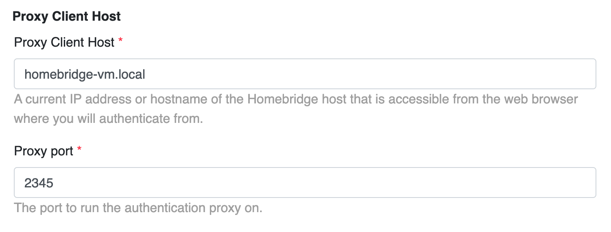
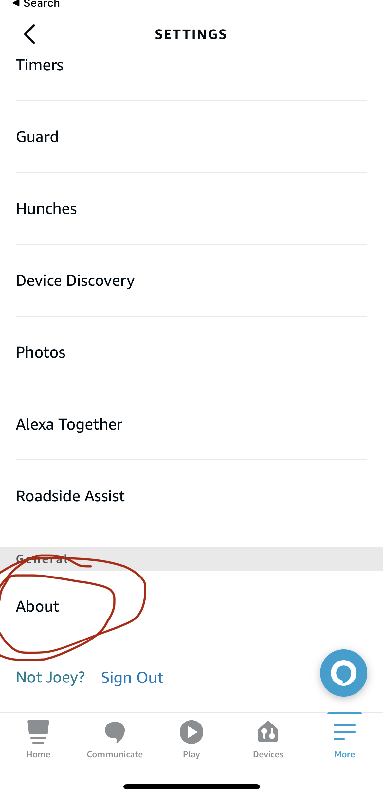
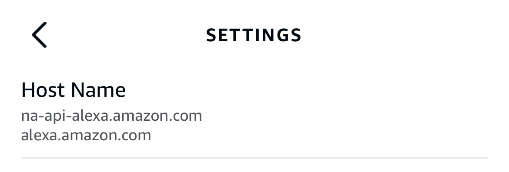
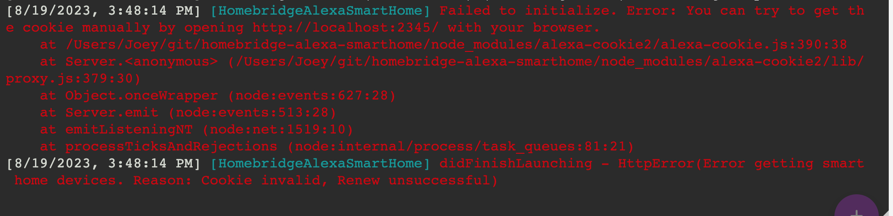
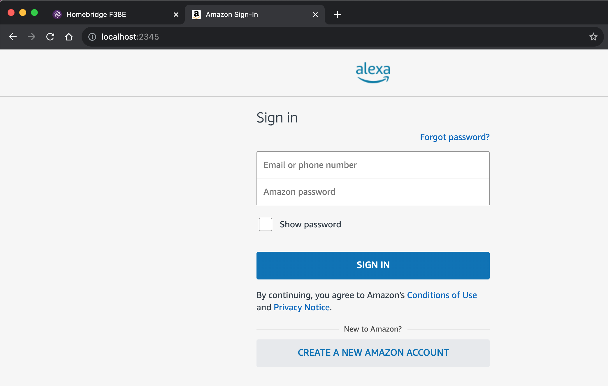
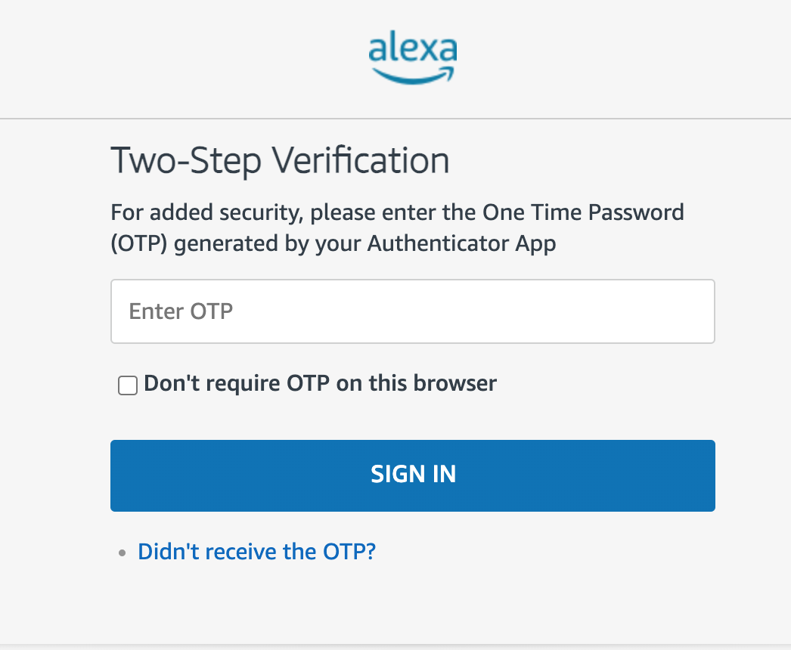
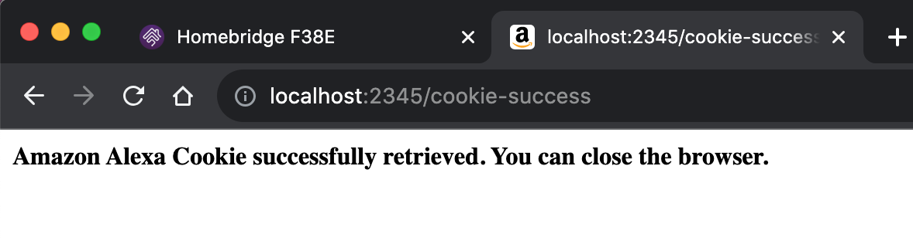

  

  
  

  
  

  
  

# Homebridge Alexa Smart Home

This plugin enables smart home device integration between HomeKit and Alexa which allows HomeKit/Siri to control smart home devices that are connected via Amazon Alexa.

This plugin **does not** allow Alexa to control devices in HomeKit. For that, please see the [Homebridge Alexa](https://github.com/NorthernMan54/homebridge-alexa) plugin.

## Table of Contents

- [Compatibility](#compatibility)
- [Currently supported devices](#currently-supported-devices)
- [Features](#features)
  - [Air quality monitors](#air-quality-monitors)
  - [Echo devices](#echo-devices)
- [Initial configuration](#initial-configuration)
- [Common issues](#common-issues)
- [Support](#support)
- [Long-term support](#long-term-support)
- [Disclaimer](#disclaimer)

## Compatibility

Compatibility is not guaranteed with HOOBS and I am unable to provide support for HOOBS users since I do not use HOOBS.

Node.js versions supported: 16.x, 18.x, 20.x

## Currently supported devices

- Lightbulbs
- Switches
  - HomeKit switches do not support brightness so any switches you have that support brightness will appear in HomeKit as Lightbulbs.
- Outlets + smart plugs
- Thermostats
- Locks
- Vacuum cleaners
- Air Quality Monitors
  - Only confirmed to work with Amazon Air Quality Monitor. Please report an issue if it doesn't work with your air quality monitor.
- Echo smart speakers / Echo smart displays
  - Play + pause
  - Next track / previous track
  - Change volume
- [Request / vote](https://homebridge-alexa-smarthome.canny.io/feedback?selectedCategory=supported-device-types) on device types you would like to see supported.

## Features

- Devices already linked to your Alexa account can be integrated with HomeKit automatically.
- Only Amazon credentials needed to configure this plugin rather than credentials for all your devices.
- This plugin does not store your Amazon username or password. Instead, it uses session cookies that are valid for up to 14 days.

### Air quality monitors

All of the following are supported depending on what your device measures:

- Air quality score (Excellent / Fair / Poor)
- Particulate matter density (PM2.5)
- VOC Density
- Carbon monoxide levels
- Relative humidity percent
- Temperature

When you first add an Air Quality Monitor to HomeKit, the above measurements may appear in the Default Room but can be assigned to any room you choose.

### Echo devices

Echo devices appear in HomeKit as Televisions which enables media control via the [Control Center remote controls](https://support.apple.com/guide/tv/use-ios-or-ipados-control-center-atvb701cadc1/tvos).

Echo devices are added to HomeKit as external accessories that need to be added manually. Restart Homebridge and review the Homebridge logs for a message similar to: `Please add [DEVICE NAME] manually in Home app. Setup Code: xxx-xx-xxx`

To use the Control Center remote controls, follow [these instructions](https://support.apple.com/guide/tv/use-ios-or-ipados-control-center-atvb701cadc1/tvos) to add the remote to your device's Control Center. Once the remote is open, you can change the device you are controlling using the `⌄` arrow next to the device name at the top of the screen.

Remote control features - **you must start the media on the Echo (music, audio book, etc) before you can control it. It may take up to a minute for the remote to start working once media is playing**:

- Play
- Pause
- Next (right arrow)
- Previous (left arrow)
- Volume control (hardware volume buttons, a.k.a. volume button on the side of your iPhone/iPad)

Siri is not supported out of the box but I may be able to support in the future.

AirPlay is unrelated to Homebridge/HomeKit and needs to be supported by the device (the Echo). If you wish to use AirPlay, the best option is to buy an AppleTV or Apple HomePod.

## Initial configuration

The first time this plugin starts, you will need to authenticate using your Amazon Alexa account. Please follow these steps in order - screenshots included.

1. Verify that your plugin configuration is correct. Specifically, the proxy `clientHost` and `port`. The `clientHost` should be the same host you use to access homebridge. For example, if you access homebridge via the url `http://my-homebridge-server.local:8581` then `clientHost` should be `my-homebridge-server.local`. The `port` should be a different value from homebridge (not 8581). Restart Homebridge if you made any changes to the settings.
   1. 
2. Download the Alexa app onto a device of your choosing (smartphone, tablet, etc) and sign in using the Amazon account your devices are linked to. Confirm the `amazonDomain` plugin setting matches what you see in the Alexa app. Go to Settings -> About, scroll to the bottom, and look for Host Name. The Host Names you see should end with the `amazonDomain` you choose in the plugin settings, it will not match exactly.
   1. 
   2. 
3. **This plugin may not work and support or help troubleshooting will not be provided** if you do not use multi-factor authentication / two-step verification or if you use SMS for the verification code. Again, SMS two step verification will **not** work. Please download an authenticator app such as AWS Virtual MFA, Google Authenticator, Microsoft Authenticator and follow the instructions to enable two step verification on Amazon's website.
4. Check the homebridge logs for an error that you must manually open the url to authenticate.
   1. 
5. Visit the url in your browser to open a login screen. It is a real login screen proxied so the plugin can capture the session cookie. The username/password are not stored by the plugin.
   1. 
6. Enter your MFA code if you have MFA enabled on your Amazon Alexa account. Again, the plugin does not store this value.
   1. 
7. If successful, you should see a message that the Amazon Alexa cookie was successfully retrieved. If you see a 404 page, return to step 3 and start over.
   1. 
8. The homebridge logs will also show a message such as "Successfully authenticated Alexa account".
   1. 

## Common issues

  
Alexa login errors or <code>Failed to initialize connection to Alexa.`</code>

  <ol>
    <li>Please ensure you have the Alexa app installed on your device (iPhone, iPad, etc).</li>
    <li>Please download an authenticator app such as AWS Virtual MFA, Google Authenticator, Microsoft Authenticator and follow the instructions to enable two step verification on Amazon's website. SMS two-step verification does not work with this plugin.</li>
    <li>Repeat <a href="#initial-configuration">initial configuration</a> steps again.</li>
    <li>Delete the <code>persist/.homebridge-alexa-smarthome</code> file in your homebridge installation directory and then restart Homebridge.</li>
    <li>Try an incognito window with Javascript disabled. <a href="https://github.com/Apollon77/ioBroker.alexa2#problems-with-cookie-determination-via-e-mailpassword">Detailed instructions</a></li>
  </ol>

  
<code>This plugin slows down Homebridge</code>

  Please update the Performance section of the plugin settings. More information can be found on the plugin settings page.

  
<code>No media player information found</code> or <code>Cannot control player because there is no media selected.</code>

  Echo devices can only be controlled once there is media (e.g. music, audio book, etc) playing.

  
I can't find my device in HomeKit/Apple Home app.

  <ul>
    <li>Please check the Default Room for the device. Air quality, humidity, and temperature sensors appear as statuses at the top of the room, not as device tiles.</li>
    <li>Double check the name of the device in the Alexa app matches the name specified in the plugin settings. Spaces, uppercase, and lowercase matter.</li>
    <li>Echo devices are added to HomeKit as external accessories that need to be added manually. Restart Homebridge and review the Homebridge logs for a message similar to: <code>Please add [DEVICE NAME] manually in Home app. Setup Code: xxx-xx-xxx</code></li>
  </ul>

## Support

Please visit the [Canny feedback board](https://homebridge-alexa-smarthome.canny.io/feedback) first to see if your issue or request is currently being worked on. You can also suggest new features and vote on features requested by others.

If you run into issues or you need help please use the [issues template](https://github.com/joeyhage/homebridge-alexa-smarthome/issues/new/choose). Fill all the relevant sections and submit your issue. It is important that you use the templates because I will automatically be assigned to your issue and I will receive an email. If you use the blank template without assigning me, I will most likely miss the Github notification.

## Long-term support

Please consider supporting the development of this plugin by sponsoring me. Sponsorship will encourage me to continue improving this plugin, support more devices, adapt to changes in the Alexa API, and fuel my late-night coding sessions. :coffee:

## Disclaimer

- I am not affiliated with Amazon nor any of the device brands and this plugin is a personal project that I maintain in my free time
- Use this plugin entirely at your own risk
- Please see license for more information
